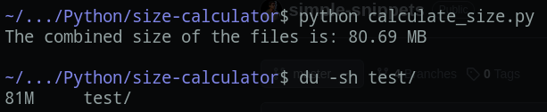

# Multiple Files Size Calculator

Make sure there is a `files.txt` file present which holds all the names of files for which combined size needs to be calculated. Also this file should be in the same directory as the main script `calculate_size.py`.

Usage:
```bash
python calculate_size.py
```
Or this can also be made executable and run as follows:
```bash
chmod +x calculate_size.py
./calculate_size.py
```

Quite accurate


